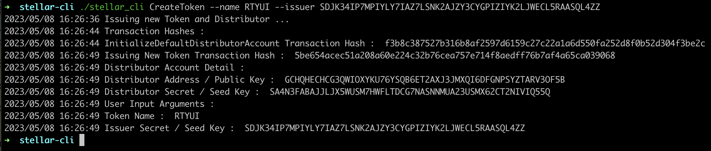
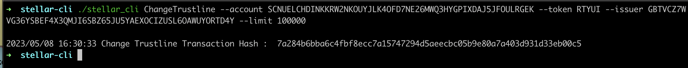
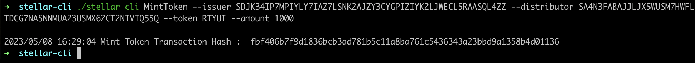
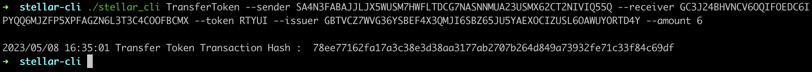
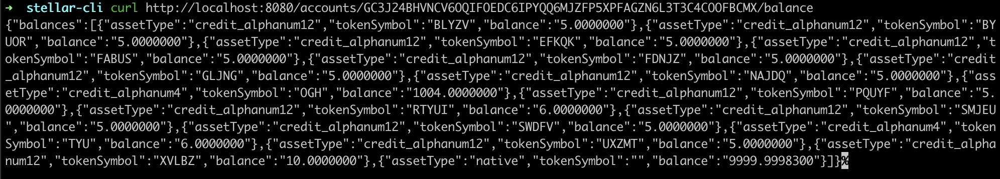
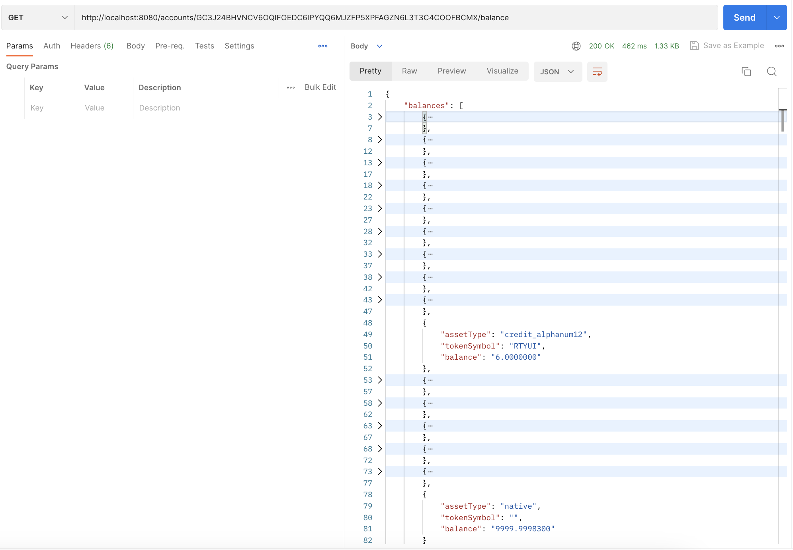
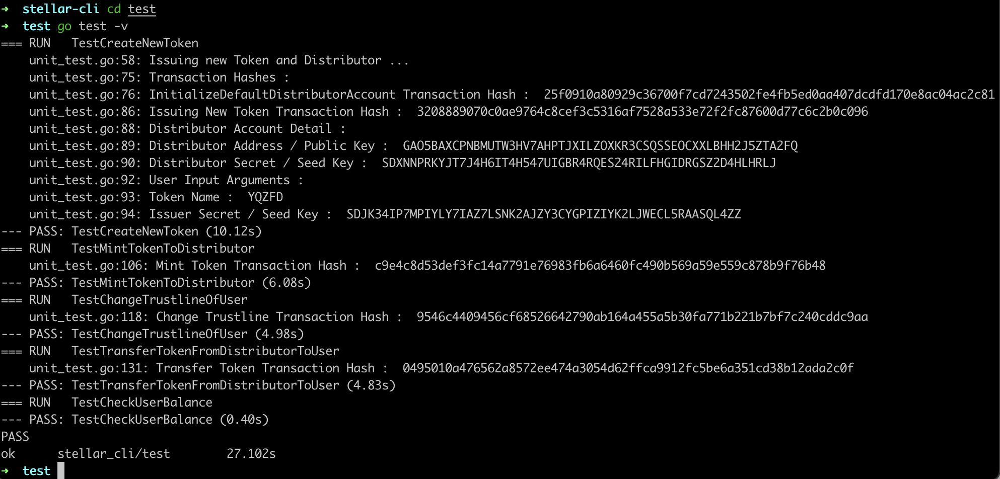

# Stellar Blockchain - Golang

# Objective

Develop a backend service in Golang that allows interaction with the Stellar network. The service should be divided into an HTTP service and a CLI service. Implement the following functionality using Stellar SDK :
1. Create a new Stellar token via CLI
2. Change the trustline for an account via CLI
3. Mint balance from issuer to distributor via CLI
4. Transfer the Stellar token via CLI
5. Check the balance of an account via HTTP service

# Prerequisites

#### Tools
  
1. Golang
  
#### Stellar Account

1. Issuer Account
  -- Issuer Test Account
  -- Issuer Public Key : "GBTVCZ7WVG36YSBEF4X3QMJI6SBZ65JU5YAEXOCIZUSL6OAWUYORTD4Y"
  -- Issuer Secret Key : "SDJK34IP7MPIYLY7IAZ7LSNK2AJZY3CYGPIZIYK2LJWECL5RAASQL4ZZ"

2. Distributor Account
  -- Distributor Test Account
  -- Distributor Public Key : "GCHQHECHCG3QWIOXYKU76YSQB6ET2AXJ3JMXQI6DFGNPSYZTARV3OF5B"
  -- Distributor Secret Key : "SA4N3FABAJJLJX5WUSM7HWFLTDCG7NASNNMUA23USMX62CT2NIVIQ55Q"
  
3. User Account
  -- User Test Account
  -- User Public Key : "GC3J24BHVNCV6OQIFOEDC6IPYQQ6MJZFP5XPFAGZN6L3T3C4COOFBCMX"
  -- User Secret Key : "SCNUELCHDINKKRW2NKOUYJLK4OFD7NE26MWQ3HYGPIXDAJ5JFOULRGEK"

* All of the accounts must have xlm test token before we can perform any transactions on the Stellar Network

# Project Setup

1. Clone this repo

2. Install the packages

# Build The Project
  
1. Type this command
`go build`
This command will create 	`stellar_cli` binary file

# Use Case Testing

1. Create a new Stellar token via CLI
- Type this command in the CLI with this format
`./stellar_cli CreateToken --name NEW_TOKEN --issuer ISSUER_SECRET_KEY`
- Example : 
- `./stellar_cli CreateToken --name RTYUI --issuer SDJK34IP7MPIYLY7IAZ7LSNK2AJZY3CYGPIZIYK2LJWECL5RAASQL4ZZ`
- Expected output :
- 

2. Change the trustline for an account via CLI
- Type this command in the CLI with this format
`./stellar_cli ChangeTrustline --account ACCOUNT_SECRET_KEY --token TOKEN_ASSET_CODE --issuer ISSUER_PUBLIC_KEY --limit LIMIT_AMOUNT`
- Example : 
- `./stellar_cli ChangeTrustline --account SCNUELCHDINKKRW2NKOUYJLK4OFD7NE26MWQ3HYGPIXDAJ5JFOULRGEK --token RTYUI --issuer GBTVCZ7WVG36YSBEF4X3QMJI6SBZ65JU5YAEXOCIZUSL6OAWUYORTD4Y --limit 100000
`
- Expected output :
- 

3. Mint balance from issuer to distributor via CLI
- Type this command in the CLI with this format
`./stellar_cli MintToken --issuer ISSUER_SECRET_KEY --distributor DISTRIBUTOR_SECRET_KEY --token TOKEN_ASSET_CODE --amount AMOUNT`
- Example : 
- `./stellar_cli MintToken --issuer SDJK34IP7MPIYLY7IAZ7LSNK2AJZY3CYGPIZIYK2LJWECL5RAASQL4ZZ --distributor SA4N3FABAJJLJX5WUSM7HWFLTDCG7NASNNMUA23USMX62CT2NIVIQ55Q --token RTYUI --amount 1000
`
- Expected output :
- 

4. Transfer the Stellar token via CLI
- Type this command in the CLI with this format
`./stellar_cli TransferToken --sender SENDER_SECRET_KEY --receiver RECEIVER_PUBLIC_KEY --token TOKEN_ASSET_CODE --issuer ISSUER_PUBLIC_KEY --amount AMOUNT`
- Example : 
- `./stellar_cli TransferToken --sender SA4N3FABAJJLJX5WUSM7HWFLTDCG7NASNNMUA23USMX62CT2NIVIQ55Q --receiver GC3J24BHVNCV6OQIFOEDC6IPYQQ6MJZFP5XPFAGZN6L3T3C4COOFBCMX --token RTYUI --issuer GBTVCZ7WVG36YSBEF4X3QMJI6SBZ65JU5YAEXOCIZUSL6OAWUYORTD4Y --amount 6
`
- Expected output :
- 

5. Check the balance of an account via HTTP service
- Start the HTTP Service by running this command : `./stellar_cli StartHTTPService` in the CLI
- Type this command in the CLI with this format
`curl http://localhost:8080/accounts/{USER_PUBLICKEY}/balance`
- Example
`curl http://localhost:8080/accounts/GC3J24BHVNCV6OQIFOEDC6IPYQQ6MJZFP5XPFAGZN6L3T3C4COOFBCMX/balance`
- Expected output :
- 
- 

# Unit Testing

  1. Go to test directory
`cd test`

  2. Type this command
`go test -v`
- Expected output :
- 

## Author

- [@fgprayogo](https://www.github.com/fgprayogo)